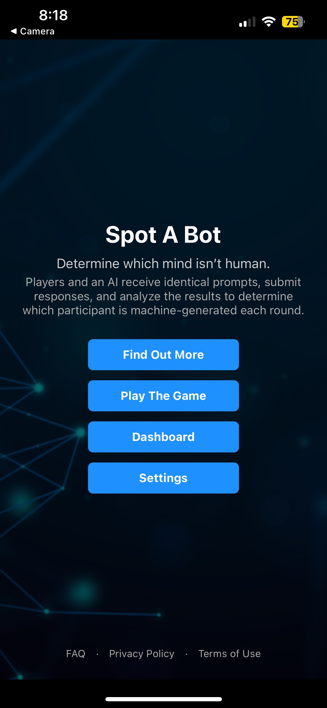
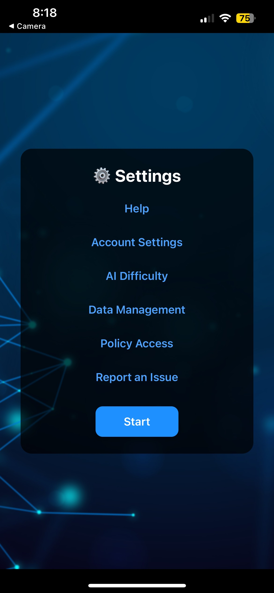
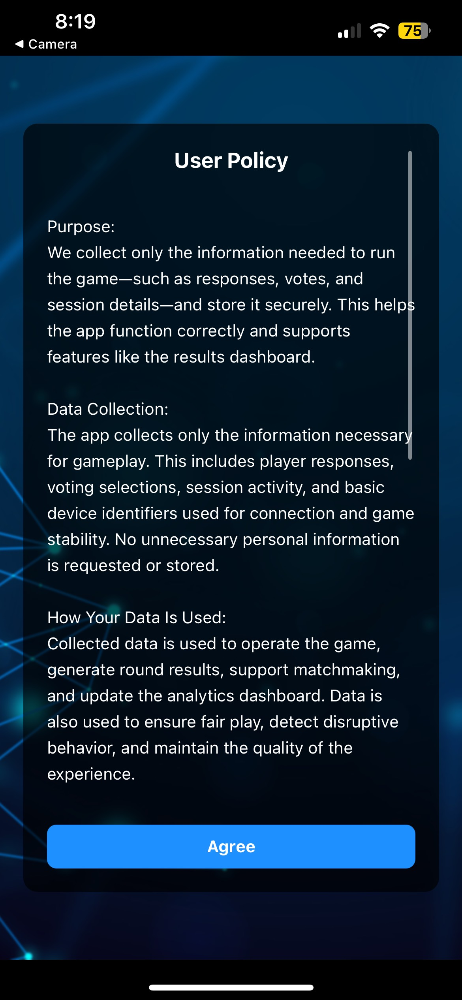
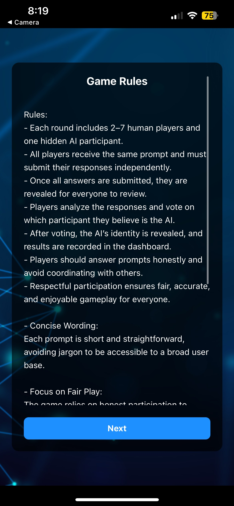
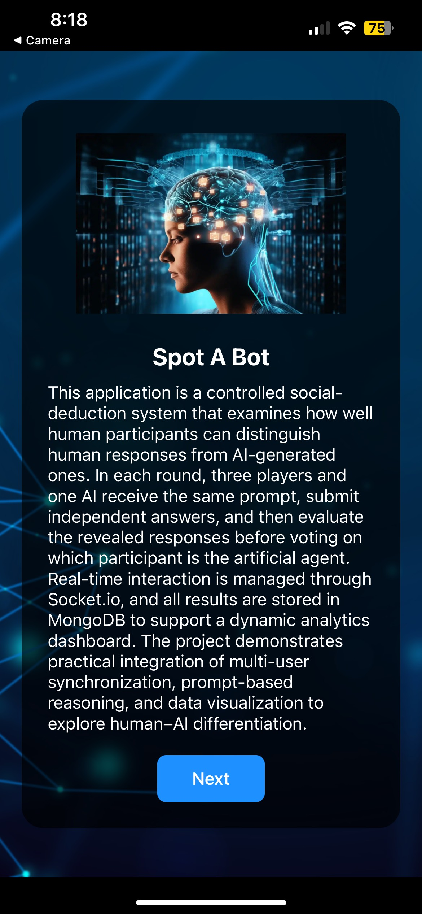
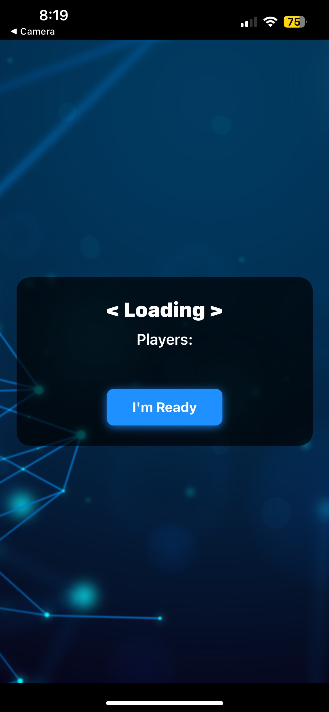
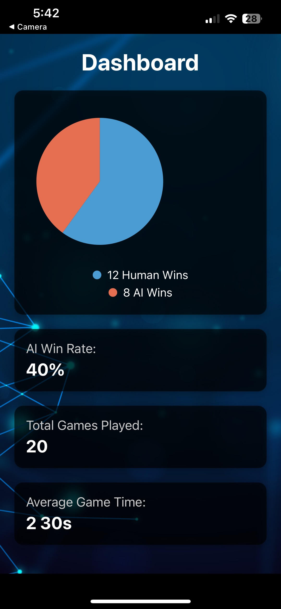

# Spot-A-Bot 

## Description

Spot A Bot is a social-deduction game built with React Native using Expo. The app creates a shared chat where players respond to the same prompt, but one participant is powered by an Ai agent. Your goal is to determine which “player” is the AI agent. 
The backend runs on Node.js with Express.js, using Socket.IO to handle the live chat between players while also sending prompts to OpenAI’s ChatGPT. As players talk and vote, the server updates session and round data in MongoDB through simple CRUD routes, while the mobile app stays in sync by calling those backend endpoints with both Axios and fetch.

---

## Features

- **Real-Time Multiplayer**  
  Powered by Socket.IO to keep messages, room updates, and game state changes instantly synced across all devices.

- **AI Impostor Powered by ChatGPT**  
  Axios sends prompts to an Express route that communicates with the ChatGPT API, generating realistic responses for the AI player.

- **React Native + Expo Frontend**  
  Cross-platform UI with fast refresh, smooth navigation, and native performance on both iOS and Android.

- **Interactive Dashboard**  
  Shows player lists, session data, and active game details. Uses Axios to pull structured session metadata and `fetch()` to run actions tied to MongoDB operations.

- **MongoDB Cluster Storage**  
  Stores game states, session history, rules, and player activity. Accessed through backend routes triggered by fetch requests from the mobile client.

- **Cross-Platform Compatibility**  
  A single codebase runs on both iOS and Android devices.

## Preview

## Home Page
The Home page acts as the main entry point to the app, A central hub allowing users to navigate through the application. the navigation is handled by `expo-router`. Buttons are implemented with `Pressable` components as anchor points into deeper parts of the app, keeping the experience fast and approachable.

  

## Settings
The Settings page allows players to adjust preferences that affect the app’s behavior and the user experience. React Native’s state hooks power the toggles and options shown here.

  

## User Policy
The User Policy screen displays long-form information within a scrollable card. All text content is dynamically inserted from a local object and rendered using a `ScrollView`, while the confirmation button advances the user through the onboarding flow via `expo-router`.

  

## Game Rules
This page provides players with the rules of the game. It shares the same styling as the User Policy page. Content is drawn from a structured object that stores all rule text. Navigation moves the player forward through onboarding until they reach the actual gameplay environment.

  

## More Info
This gives more information on the game such as, what it is and why we have built it.

  

## Game Session
The Game Session is the main experience, this is where real players and the AI interact in real time. Messages and game events are handled through Socket.IO, ensuring instant updates across all devices. When the AI responds, the app sends an Axios request to an Express route, which forwards the prompt to the ChatGPT API. The AI’s response is then sent back to all players via Socket.IO to simulate a fully active participant. Additional game state, such as session history or round data, is stored in our mongodb cluster for analytics.

  

## Dashboard
The Dashboard provides players with a detailed overview of past sessions, results, and analytics. It retrieves data from the database using crud operations. `fetch()` communicates with backend routes that read and update stored documents in MongoDB. This keeps the dashboard responsive while also supporting more complex data operations behind the scenes. Each component is built to scale as additional metrics or visualization features are added in future versions.

  

